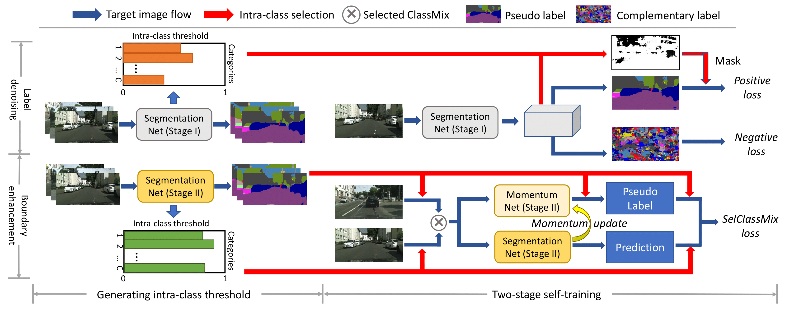
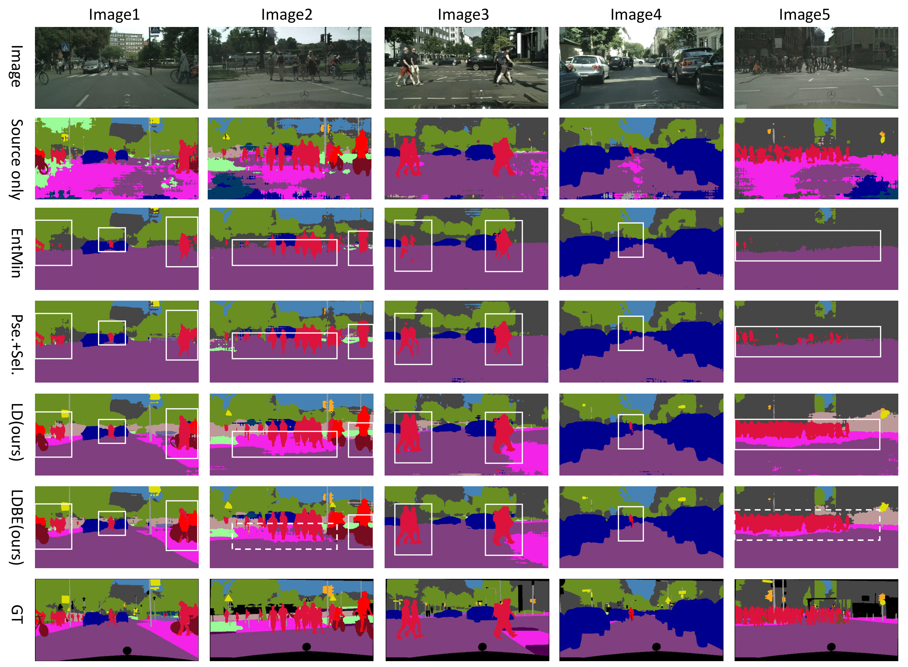

# LDBE
Pytorch implementation for two papers (the paper will be released soon):

"Domain Adaptive Semantic Segmentation without Source Data", ACM MM2021.

"Challenging Source-free Domain Adaptive Semantic Segmentation", submitted to TPAMI.

## Method

## Result
GTA5 -> Cityscapes:

|  Methods| Source-only | LD | LDBE |
|  ----  | ----  |----|----|
| mIoU | 35.7 | 45.5 | 49.2 |

SYNTHIA -> Cityscapes:

|  Methods   | Source-only | LD | LDBE |
|  ----  | ----  |----|----|
| mIoU (16-classes)  | 32.5 | 42.6 | 43.5 |
| mIoU (13-classes)  | 37.6 | 50.1 | 51.1 |

## Data

Download [GTA5](https://download.visinf.tu-darmstadt.de/data/from_games/).

Download [SYNTHIA](http://synthia-dataset.net/). Please use SYNTHIA-RAND-CITYSCAPES

Download [Cityscapes](https://www.cityscapes-dataset.com/).

Make sure the data path is consistent with the path in config file.

## Training (TODO)

Stage 0: Training on the source domain data.

Run "run_so.py". The trained model is available at ...

Stage 1: Label denoising (both positive learning and negative learning).

Set method:"ld" in config/ldbe_config.yml. Then, run "run.py". The trained model is available at ...

Stage 2: Boundary enhancement

Set method:"be" in config/ldbe_config.yml. Then, run "run.py". The trained model is available at ...

## Acknowledgement

[https://github.com/Solacex/CCM](https://github.com/Solacex/CCM)

[https://github.com/yzou2/CRST](https://github.com/yzou2/CRST)
